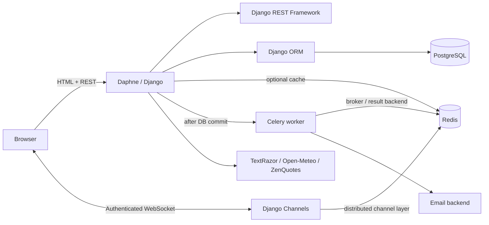
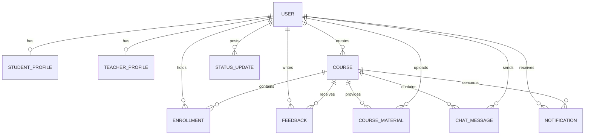

# eLearning Platform

A role-aware Django learning platform for course discovery, enrollment, learning
resources, instructor management, feedback, notifications, REST access,
background email delivery, and real-time course discussion.

## Project context

This began as a substantial university software project and was later revisited,
redesigned, and productionised as an independent portfolio project. It is not
presented as professional employment or as a production-proven LMS. The current
repository demonstrates production-oriented architecture, explicit trade-offs,
and a deployment-ready public-demo configuration.

## Architecture



The code supports three explicit operating modes:

| Mode | Database | Real-time | Background work | Cache | Media |
|---|---|---|---|---|---|
| Complete local stack | PostgreSQL 16 | Channels + Redis | Celery + Redis | Redis | Docker volume |
| Public portfolio demo | Persistent Neon PostgreSQL | Single-process Channels fallback | Disabled unless separately provisioned | Process-local fallback | Disabled unless object storage is configured |
| Lightweight development/test | SQLite | In-memory channel layer | Disabled | In-memory | Local filesystem |

Redis is not claimed as a generic requirement. In the complete stack it is used
for the Channels layer, Celery broker/result backend, and application caching.
The public demo remains useful without it and labels its single-process
real-time limitation.

## User experience

The implemented application roles are **learner** and **instructor**. Django
staff/superuser access is separate.

- Learners see enrolled courses, available resources, course notifications,
  enrollment actions, feedback, and enrollment-scoped discussion.
- Instructors see courses they own, active enrollment and resource counts,
  learner management, resource upload controls, and enrollment activity.
- Anonymous visitors can browse the course catalog and course descriptions, but
  cannot see learner identities or protected resources.

The interface deliberately does not show completion percentages, modules, or
lessons: the current data model does not store them. The redesign prioritizes
honest orientation and a clear next action over invented dashboard metrics.

## Data model



Identity data is referenced through foreign keys instead of being copied into
enrollments, feedback, messages, or status updates. Important integrity rules
include one enrollment per learner/course, rating bounds at both validation and
database levels, non-negative material counters, and one-to-one role profiles.
Foreign-key indexes support the dominant course/user access paths; no speculative
indexes were added.

## REST API

Visit `/api-docs/` for a concise endpoint guide or `/api/` for DRF's browsable
router. Representative endpoints:

| Method | Endpoint | Access |
|---|---|---|
| `GET` | `/api/courses/` | Public |
| `GET` | `/api/courses/{id}/` | Public |
| `POST` | `/api/courses/{id}/enroll/` | Learner |
| `POST` | `/api/courses/{id}/feedback/` | Active enrolled learner |
| `GET/PATCH` | `/api/students/{id}/` | Authenticated, owner-scoped writes |
| `GET/PATCH` | `/api/teachers/{id}/` | Authenticated, owner-scoped writes |
| `POST` | `/api/course/analyze/` | Instructor |
| `GET` | `/api/weather/` | Public |

List endpoints are paginated. Course queries use annotations and related-object
loading to avoid per-row aggregate queries. Profile responses omit email, date
of birth, and phone data.

## Background processing

Celery sends enrollment and feedback emails outside the request/response path.
Tasks are scheduled with `transaction.on_commit`, so a worker cannot observe an
uncommitted row. Missing/deleted records are safe no-ops; delivery failures are
logged and remain task failures rather than false successes. Automatic retry is
deliberately not enabled because email delivery is not inherently idempotent and
an ambiguous SMTP failure could produce duplicates.

If Celery is disabled or its broker is unavailable, the enrollment or feedback
write remains successful. The optional dispatch failure is logged.

## Real-time behavior

The existing real-time feature is a course discussion:

```text
enrolled learner action
→ authenticated WebSocket consumer
→ authorization against active enrollment/course ownership
→ persisted ChatMessage
→ Channels group broadcast
→ visible update in every connected course session
```

Anonymous and unenrolled connections are rejected before joining the group.
Payloads are type/length validated, and the browser renders message text with
DOM `textContent` rather than HTML insertion. Redis provides a distributed
channel layer in the complete stack; the public single-process fallback is
clearly labeled.

## External integrations and graceful degradation

- **TextRazor** optionally analyzes instructor course drafts. Missing keys,
  timeouts, invalid responses, and request errors use deterministic keyword
  analysis labelled as fallback output.
- **Open-Meteo** provides Helsinki weather. Responses are validated and stored
  in `WeatherCache`; stale database data is returned if the live API fails.
- **ZenQuotes** provides a quote endpoint. The full stack caches a validated
  response in Redis; local/public-demo modes use an in-process cache. Failures
  return clearly sourced local copy.

External timeouts are configurable. Exceptions are logged without credentials
or response secrets, and raw exception details are not returned to clients.

## Access control

- Course creation, edits, resources, and learner management require an
  instructor profile and course ownership.
- Enrollment and feedback require a learner profile; feedback additionally
  requires an active enrollment.
- Public deployment disables self-service instructor registration; the seeded
  instructor account remains available for the demo.
- Course resources and WebSockets require active enrollment, course ownership,
  or superuser access.
- Notification queries are scoped to the authenticated recipient.
- Profile directories require authentication, learner lookups are scoped, and
  object writes require ownership.
- Logout and notification-state changes use POST requests with CSRF protection.

This is sensible application-level access control, not a claim of
enterprise-grade security.

## Health and observability

- `/livez/` confirms the web process can answer HTTP.
- `/readyz/` and the Render-compatible `/healthz/` execute `SELECT 1` against
  the configured database.
- Structured console logging covers optional task dispatch, task outcomes,
  external-service degradation, cache failures, and WebSocket joins without
  logging message bodies, passwords, or API keys.

## Testing and CI

Baseline audit: **60/60 tests passed** on SQLite.

Final suite: **85 tests** covering models, constraints, forms, authentication,
HTML workflows, scoped REST APIs, optional infrastructure failure, external
fallbacks, Celery task behavior, Redis/cache degradation, and end-to-end ASGI
WebSocket authorization/persistence/broadcast.

Run locally:

```bash
python manage.py check
python manage.py makemigrations --check --dry-run
python manage.py test
```

`.github/workflows/ci.yml` runs on pushes and pull requests with PostgreSQL 16
and Redis 7 services. It checks migration drift, applies migrations to
PostgreSQL, runs Django checks, builds production static assets, and executes
the complete suite. CI is configured but cannot be claimed as passing until the
repository is pushed to GitHub and the workflow runs there.

## Run locally with Docker

Requirements: Docker Engine and Docker Compose.

```bash
docker compose up --build
```

Open <http://localhost:8000>. Compose starts Django/Daphne, PostgreSQL, Redis,
and a Celery worker. PostgreSQL and media use named volumes.

Useful commands:

```bash
docker compose run --rm web python manage.py test
docker compose run --rm web python manage.py seed_demo
docker compose down
```

`docker compose down` preserves named volumes. This host did not provide Docker,
so the Compose stack could not be executed during the final local verification;
fresh migrations and seeding were verified against an isolated SQLite database,
and CI is responsible for the PostgreSQL-backed verification.

## Lightweight local setup

```bash
python3 -m venv .venv
source .venv/bin/activate
python -m pip install -r requirements.txt
cp .env.example .env
python manage.py migrate
python manage.py seed_demo
python manage.py runserver
```

`.env.example` defaults to SQLite, in-memory cache/channels, disabled Celery,
and local media. Never commit `.env` or a real database/API credential.

## Demo accounts

The seed command is deterministic and safe to rerun.

| Role | Email | Password | Scope |
|---|---|---|---|
| Learner | `student1@test.com` | `testpass123` | Non-privileged demo account |
| Instructor | `teacher1@test.com` | `testpass123` | Owns Full Stack Web Development |

Local debug mode can also create an `admin`/`admin123` superuser. Production
creates no admin unless `DEMO_ADMIN_PASSWORD` is explicitly supplied. Override
all demo passwords for a private/non-public environment.

## Public demo deployment

Recommended public architecture:

- Render Python web service using `render.yaml`;
- persistent Neon PostgreSQL through a pooled `DATABASE_URL` with
  `sslmode=require`;
- static assets served by WhiteNoise;
- media uploads disabled unless S3-compatible object storage is configured;
- Celery/Redis omitted unless separate services have actually been provisioned.

Deployment steps:

1. Create a Neon project and copy its pooled connection URL.
2. Create a Render Blueprint from this repository.
3. Set the secret `DATABASE_URL`; never add it to source or deployment YAML.
4. Deploy. `start.sh` applies migrations, optionally refreshes deterministic
   seed data, then starts Daphne.
5. Verify `/livez/`, `/readyz/`, authentication, a learner action, and data
   persistence across a redeploy.

Free web services may sleep, so the first request can have a cold start. No
artificial keep-alive traffic is used. There is currently **no verified live
URL** in this repository; do not describe the public deployment as active until
the external Render and Neon resources have been created and checked.

## 3–5 minute interview walkthrough

1. Start the complete stack and open the anonymous catalog to explain public vs
   protected data.
2. Log in as `student1@test.com`; show the role-aware dashboard and enrolled
   courses.
3. Open **Full Stack Web Development** and explain why resources, feedback, and
   discussion depend on active enrollment.
4. Open the discussion in a second learner/instructor browser session and send
   one message; show the immediate WebSocket update and persisted refresh.
5. Submit feedback; point to the Celery worker output and explain the
   `transaction.on_commit` / graceful-dispatch boundary.
6. Log in as `teacher1@test.com`; show enrollment management and ownership-bound
   course actions.
7. Open `/api-docs/`, then one browsable course endpoint.
8. Finish with the architecture/ER diagrams and the 85-test CI workflow.

## Engineering decisions and trade-offs

- Retained one coherent Django monolith: the domain does not justify
  microservices or Kubernetes.
- Kept Django templates instead of adding a SPA framework; this preserves the
  existing architecture while allowing a substantial UX redesign.
- Used PostgreSQL for deployment/full-stack environments and kept SQLite only as
  a low-friction local/test fallback.
- Made Redis/Celery optional for public-demo reliability rather than falsely
  claiming the full distributed architecture is hosted.
- Kept synchronous database notifications in signals and asynchronous external
  email in Celery.
- Added only constraints supported by current semantics. Multiple feedback
  entries remain allowed because historical data already uses that behavior.
- Protected learning resources and discussions by enrollment without inventing
  lesson completion or progress data that the schema cannot support.

## Limitations and next steps

- The model has courses and resources, not modules, lessons, assignments, or
  completion tracking.
- Public deployment still requires owner-created Render and Neon resources.
- Compose could not be executed on the audit host because Docker was absent.
- The frontend received accessibility-conscious improvements, not a formal WCAG
  audit or user study.
- Email tasks are best-effort and deliberately do not auto-retry; a delivery
  ledger/outbox would be needed for idempotent retries.
- The in-memory public WebSocket fallback is single-process and loses live
  connections on restart/sleep.
- Uploaded-file extension/size validation is present, but production malware
  scanning is outside this project's current scope.

Further portfolio copy and interview preparation are in
[`docs/portfolio-case-study.md`](docs/portfolio-case-study.md) and
[`docs/interview-guide.md`](docs/interview-guide.md).
